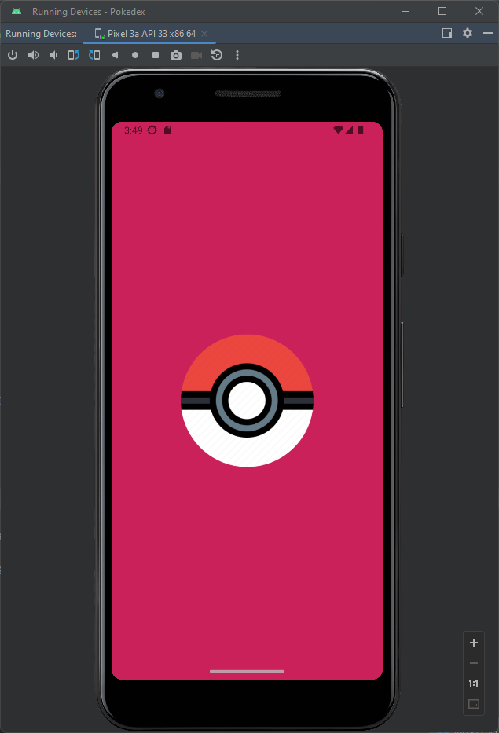
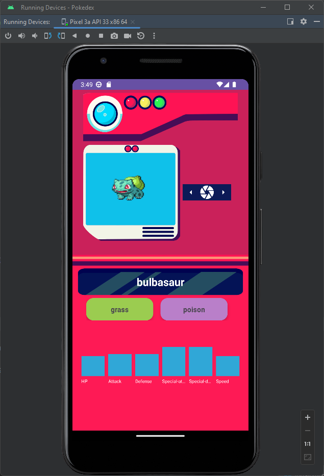
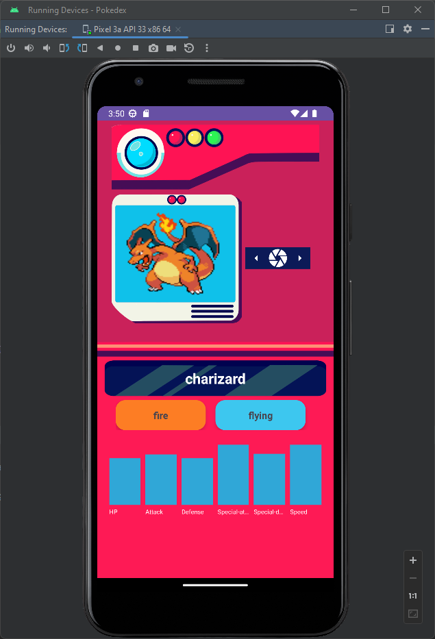

# Pokedex Básica en Android con Kotlin

Este proyecto es una pokedex básica de Pokémon que consume la PokeAPI y muestra las estadísticas de los Pokémon por Pokémon, asi como tambien el tipo de pokémon. Además, incluye un splash screen y utiliza Retrofit, Gson, Picasso y ViewBinding.

## Capturas de Pantalla

<table>
  <tr>
    <td></td>
    <td></td>
    <td></td>
  </tr>
</table>

## Ejemplo de funcionamiento

## Características

- Consulta la PokeAPI para obtener datos de Pokémon.
- Muestra las estadísticas de los Pokémon por Pokémon.
- Pantalla de inicio (splash screen) para dar la bienvenida a los usuarios.
- Utiliza Retrofit para realizar peticiones HTTP.
- Utiliza Gson para analizar respuestas JSON.
- Carga imágenes de Pokémon con Picasso.
- Utiliza ViewBinding para una gestión más eficiente de las vistas.

## Requisitos de Instalación

- Android Studio 7.0 o superior.
- Dispositivo Android o Emulador con API 24 (Android 7.0 Nougat) o superior.

## Configuración del Proyecto

1. Clona este repositorio en tu máquina local.
2. Abre el proyecto en Android Studio.
3. Asegúrate de que las dependencias, incluyendo Retrofit, Gson, Picasso y ViewBinding, están configuradas en tu archivo `build.gradle` (module.app).
4. Sincroniza el proyecto con Gradle si es necesario.

## Créditos

- [PokeAPI](https://pokeapi.co/): API de datos de Pokémon.
- [Retrofit](https://square.github.io/retrofit/): Biblioteca para realizar peticiones HTTP en Android.
- [Gson](https://github.com/google/gson): Biblioteca para analizar JSON en Java.
- [Picasso](https://square.github.io/picasso/): Biblioteca para cargar imágenes en Android.
- [ViewBinding](https://developer.android.com/topic/libraries/view-binding): Biblioteca de enlace de vistas de Android.

